# 🚀 Anikesh Jain — Developer Portfolio

> A modern, futuristic personal portfolio showcasing full-stack web development, projects, creative work, certifications, achievements, technical involvement, and personal growth.

## 🌐 Live Portfolio

**[Visit Portfolio](https://anikesh-portfolio-seven.vercel.app/)**

---

## 📖 About

This portfolio is built as a complete personal portfolio experience rather than a simple resume website.

It brings together:

- Full-stack web development
- Real-world projects
- Creative and graphic design work
- Technical certifications
- Achievements and competition work
- Technical and creative involvement
- Personal learning journey

---

## ✨ Features

### 🏠 Personal Portfolio
- Futuristic developer-focused homepage
- Interactive hero visual
- About and featured content
- Personal development journey
- Responsive layouts and smooth interactions

### 💻 Projects
Dedicated project pages with project overview, features, technology stack, technical details, screenshots, live demos, GitHub repositories, and case-study style information.

Featured projects:

- **Aura Store** — Full-stack e-commerce platform
- **SmartExpense** — Personal finance and savings platform

### 🎨 Creative Portfolio
A dedicated creative archive containing posters, banners, social media designs, event creatives, magazines, invitations, logos, T-shirt designs, and other visual work.

The media system supports images, PDFs, and videos.

### 🏆 Achievements
Dedicated section for awards, competitions, and accomplishments.

### 🏅 Certifications
- Certificate search and filtering
- Pagination
- Certificate preview
- Original certificate assets

### 👥 Involvement
Showcases technical and creative involvement across CSI, Yavanika, Spectra, and other technical/community activities.

### 📊 Private Analytics
Integrated with **Vercel Web Analytics** for portfolio usage and engagement tracking.

---

## 🎨 Design

The portfolio follows a futuristic **dark cosmic / neon** visual direction with glassmorphism, neon borders, ambient glows, cosmic backgrounds, animated particles, responsive layouts, micro-interactions, and smooth animations.

---

## 📸 Portfolio Screenshots

### Homepage
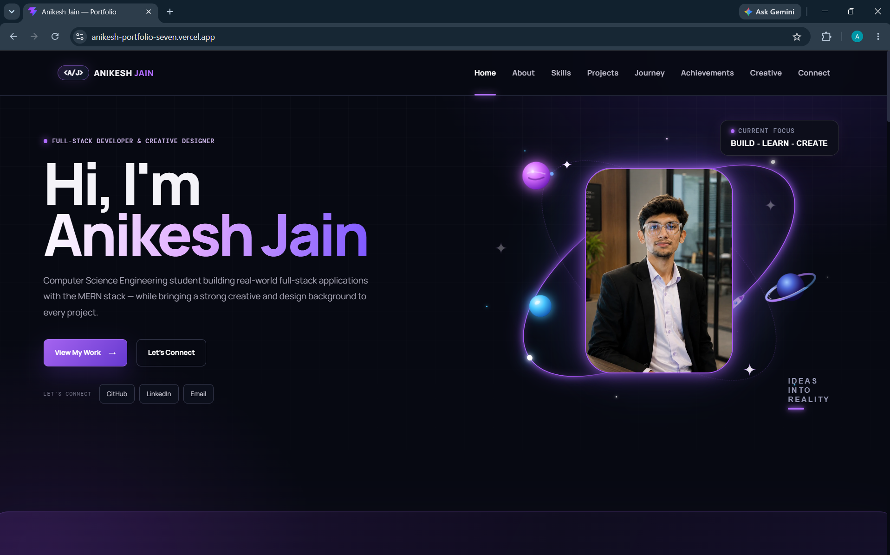

### About
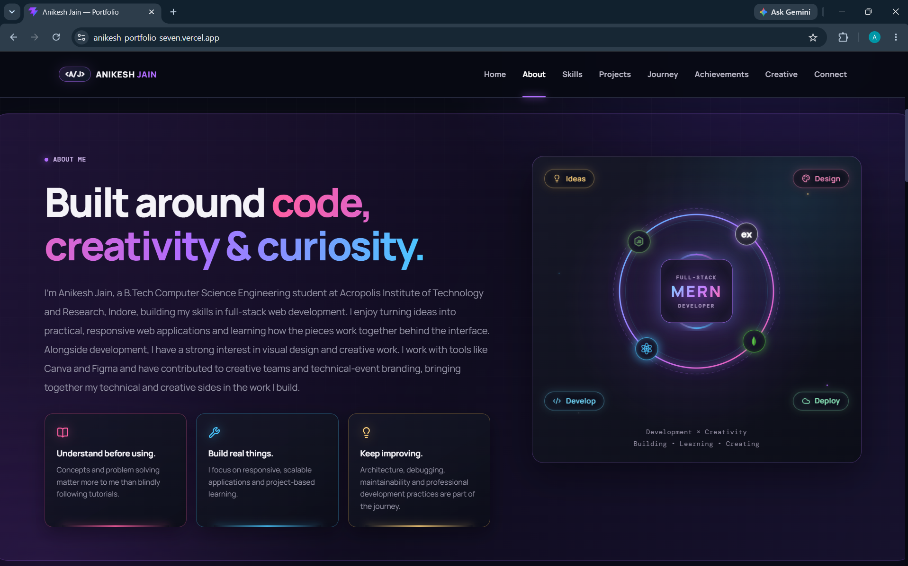

### Skills & Technologies
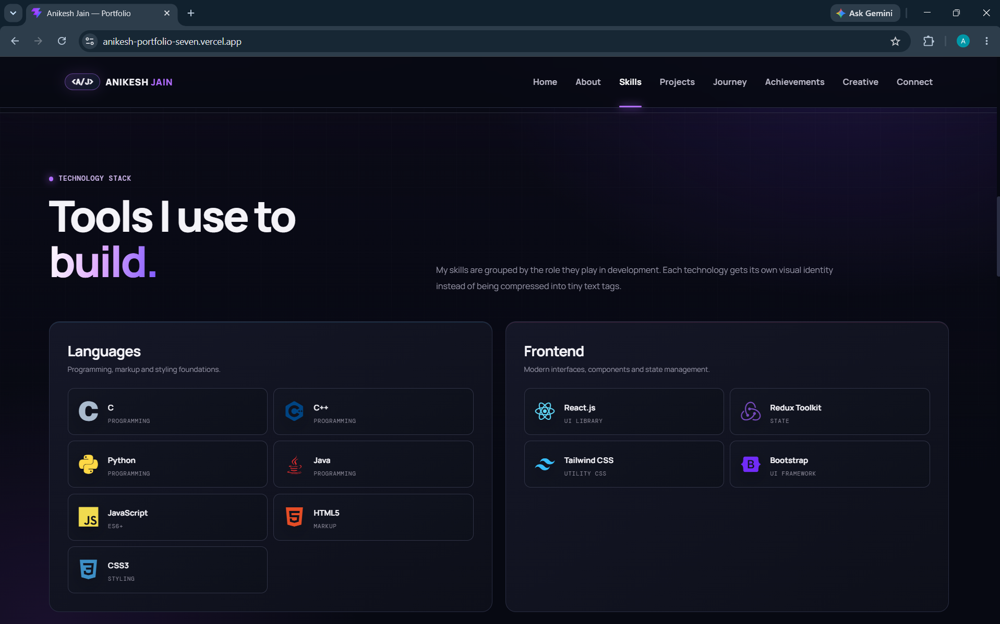

### Featured Projects
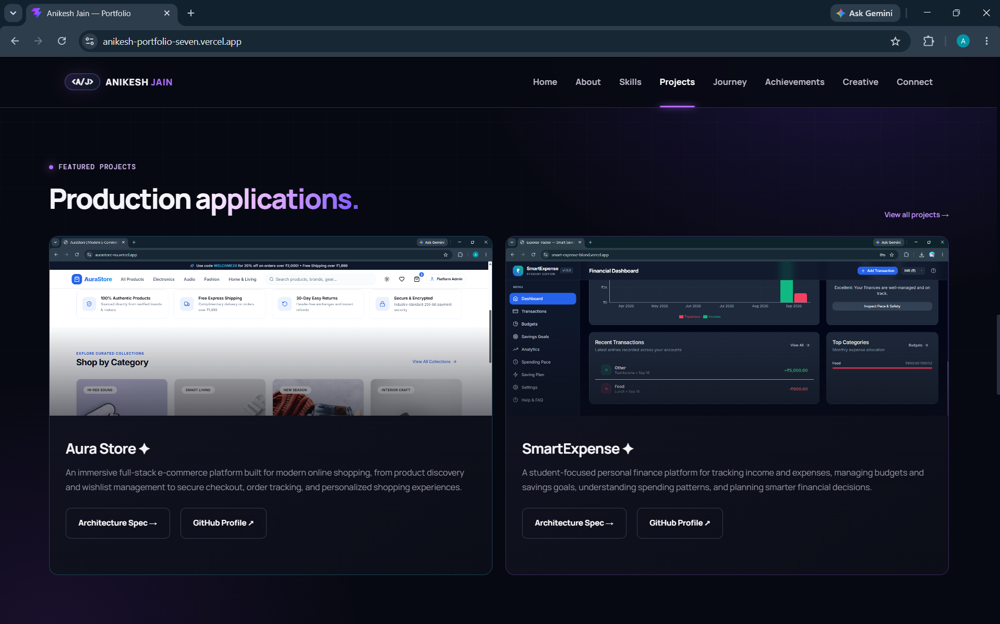

### Journey — Growth
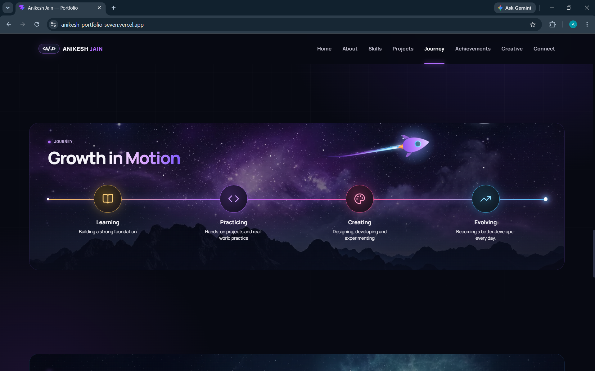

### Journey — Explore
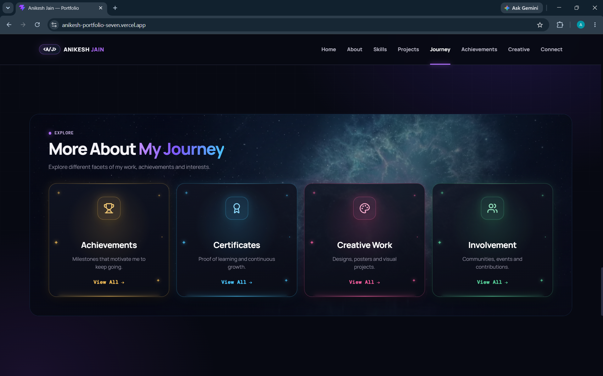

### Connect
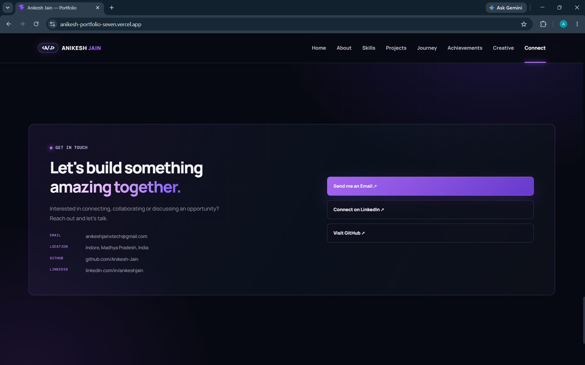

### Footer
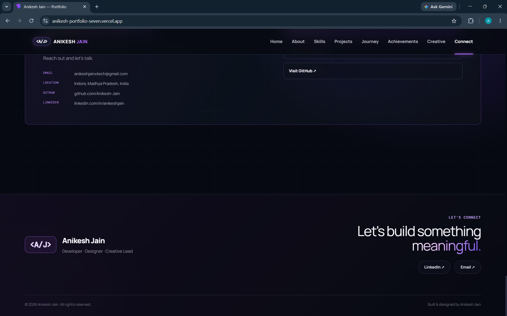

### Achievements
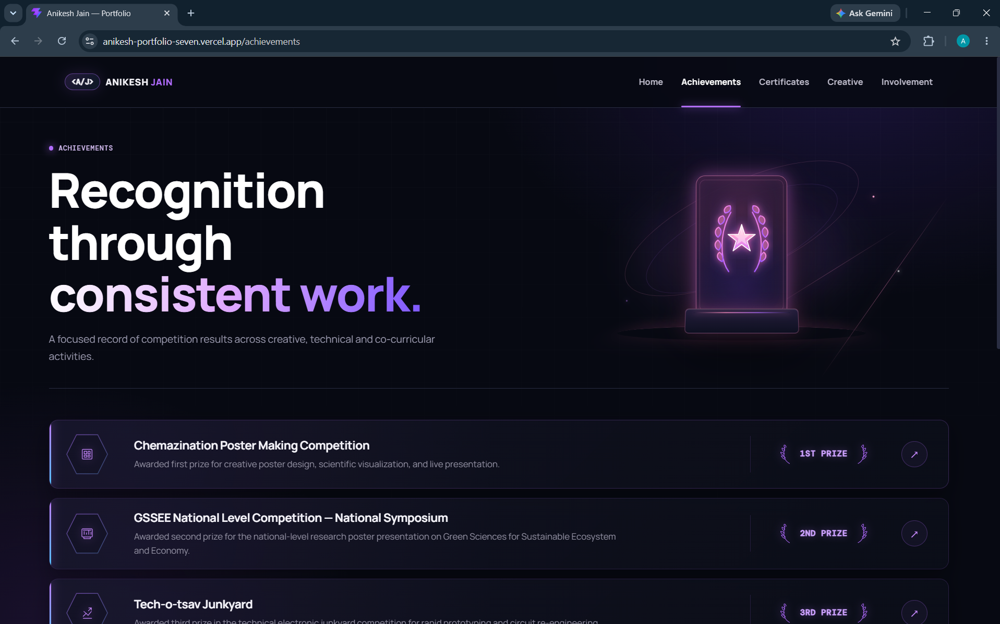

### Certificates
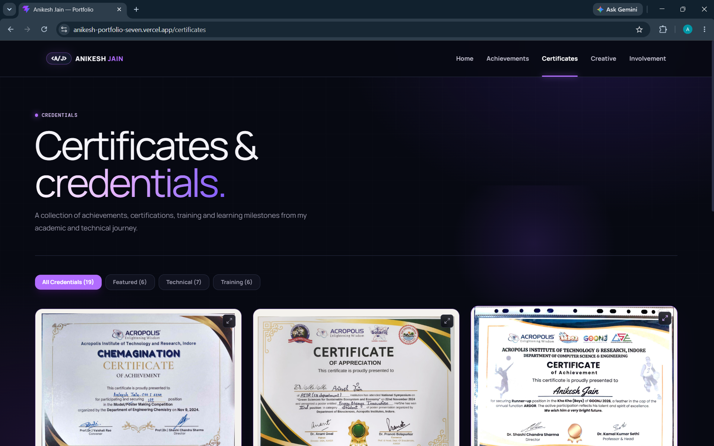

### Creative Archive
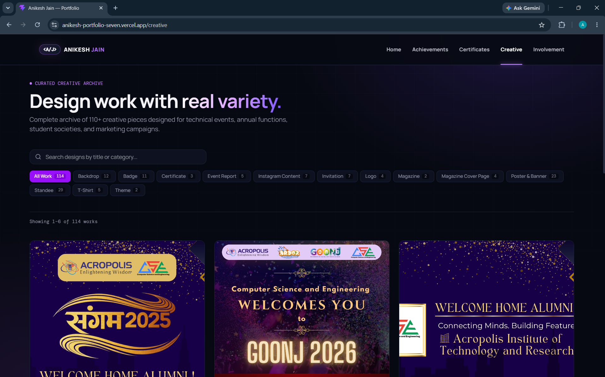

### Technical & Creative Involvement
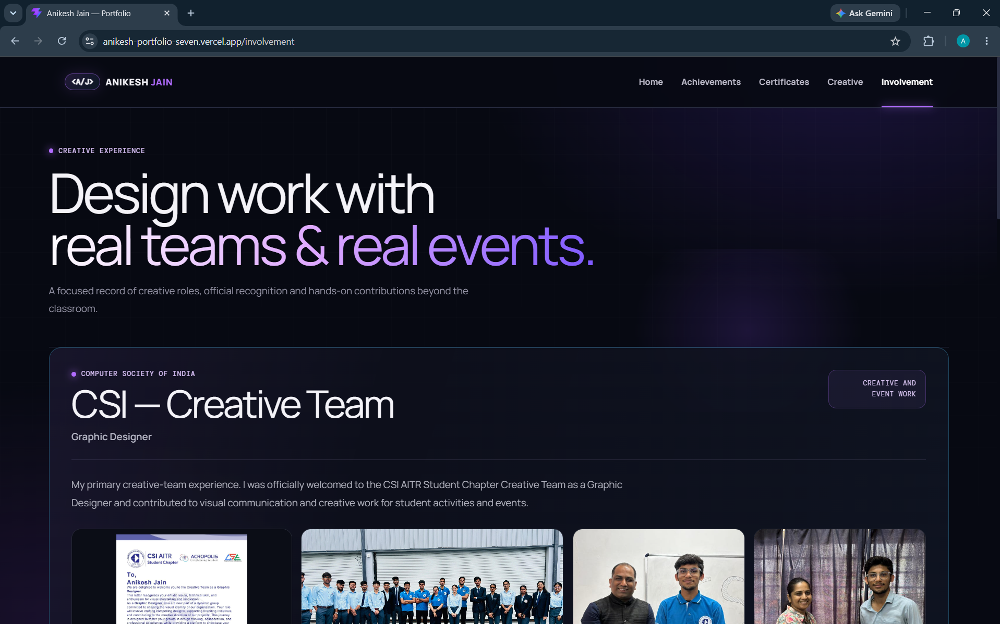

---

## 🧭 Main Routes

```text
/
├── /achievements
├── /certificates
├── /creative
├── /involvement
├── /projects
└── /projects/:slug
```

---

## 📂 Project Structure

```text
Portfolio/
├── public/
│   └── assets/
│       ├── certificates/
│       ├── creative-archive/
│       ├── involvement/
│       ├── profile/
│       └── projects/
│
├── src/
│   ├── assets/
│   ├── components/
│   ├── data/
│   ├── hooks/
│   ├── lib/
│   ├── pages/
│   ├── sections/
│   ├── styles/
│   └── utils/
│
├── docs/
│   └── screenshots/
│
├── index.html
├── package.json
├── vite.config.js
└── README.md
```

---

## 🚀 Getting Started

### Clone the repository

```bash
git clone https://github.com/Anikesh-Jain/anikesh-portfolio.git
cd anikesh-portfolio
```

### Install dependencies

```bash
npm install
```

### Start development server

```bash
npm run dev
```

---

## 🔍 Verification

The project has been verified with:

```bash
npm run build
npm run lint
```

Current status:

- ✅ Production build passing
- ✅ Oxlint passing with 0 warnings
- ✅ Oxlint passing with 0 errors
- ✅ Homepage verified
- ✅ Project pages verified
- ✅ Certificate pages verified
- ✅ Creative archive verified
- ✅ Media modals verified
- ✅ Route navigation verified
- ✅ Analytics events verified

---

## 📌 Featured Projects

### Aura Store

A production-style full-stack e-commerce platform built with Next.js, PostgreSQL, Prisma, authentication, Razorpay, Cloudinary, Resend, and modern UI tooling.

- **GitHub:** https://github.com/Anikesh-Jain/aurastore
- **Live:** https://aurastore-nu.vercel.app

### SmartExpense

A full-stack personal finance platform focused on expense tracking, budgeting, savings goals, analytics, spending pace, multi-currency support, and financial planning.

- **GitHub:** https://github.com/Anikesh-Jain/smart-expense
- **Live:** https://smart-expense-blond.vercel.app

---

## 👨‍💻 About Me

I'm **Anikesh Jain**, a B.Tech Computer Science Engineering student at **Acropolis Institute of Technology and Research, Indore**.

I'm focused on full-stack web development, particularly the MERN stack, while continuing to explore creative design and visual communication.

I enjoy turning ideas into practical, responsive web experiences and understanding how the different parts of a product work together.

---

## 📬 Connect

- **GitHub:** https://github.com/Anikesh-Jain
- **LinkedIn:** https://www.linkedin.com/in/anikeshjain/
- **Portfolio:** https://anikesh-portfolio-seven.vercel.app/

---

## 📄 License

This repository represents my personal portfolio and creative work.

Please do not reuse personal information, photographs, certificates, or creative assets without permission.
